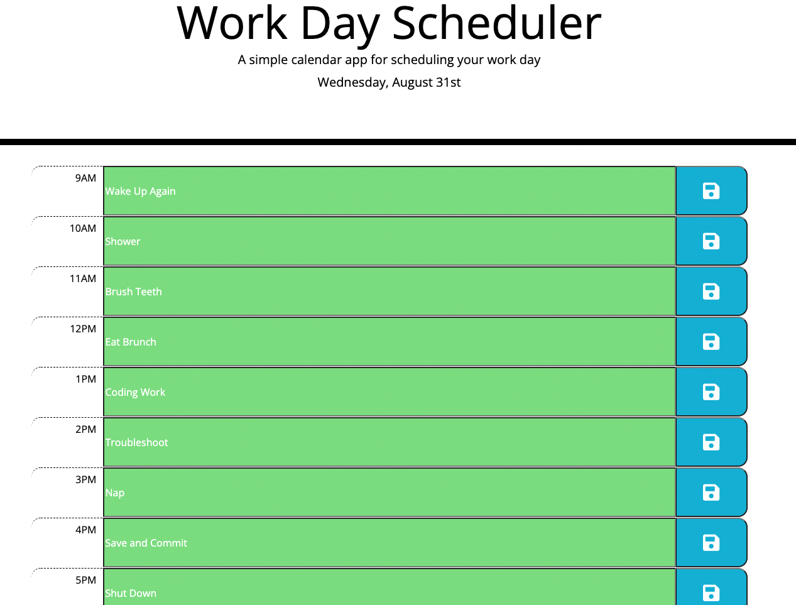

# Work Day Scheduler

## Table of Contents

-[Screenshot](#ScreenShot)
-[Description](#Description)
-[Links](#Links)

## Screenshot 

## Description 

Challenge was to create a single day scheduler to keep track of tasks or to-do items that day to help manage time effectively. Input fields display gray if the timeblock is in the past, red if it's the current hour, and green if it's in the future. Required use of moment.js and other third-party APIs to complete. Javascript written from scratch. 

## Links 

-[Site Link](https://michael-alvarado.github.io/Work-Day-Scheduler/)
-[Repository Link](https://github.com/Michael-Alvarado/Work-Day-Scheduler)
